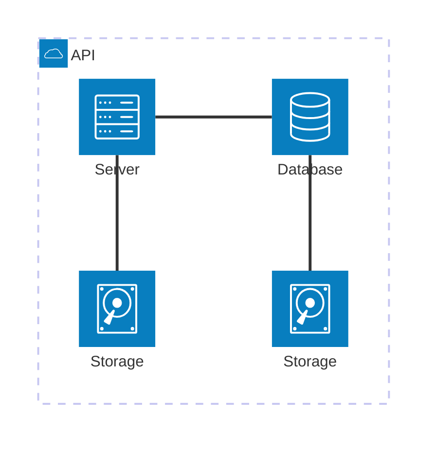

An architecture graph:

```mermaid
architecture-beta
    group api(cloud)[API]

    service db(database)[Database] in api
    service disk1(disk)[Storage] in api
    service disk2(disk)[Storage] in api
    service server(server)[Server] in api

    db:L -- R:server
    disk1:T -- B:server
    disk2:T -- B:db

```

Here is a simple flow chart:

```mermaid
graph TD;
    A-->B;
    A-->C;
    B-->D;
    C-->D;
```

Mermaid version
```mermaid
  info
```
